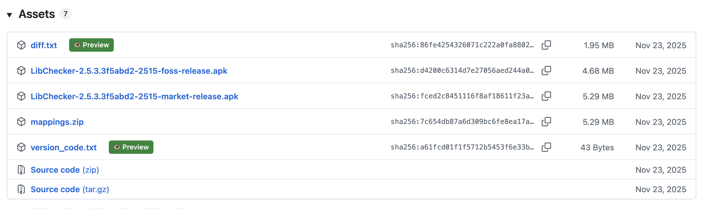

# GitHub Assets Preview (Tampermonkey)

Preview text-based GitHub release assets directly in the browser, without downloading to local storage.

This userscript adds a **Preview** button next to supported release asset links on GitHub release pages.

## Greasy Fork

[Script Page](https://greasyfork.org/zh-CN/scripts/571911-github-assets-preview)

[](https://greasyfork.org/en/scripts/571911)
[](https://greasyfork.org/en/scripts/571911)
[](https://greasyfork.org/en/scripts/571911)

## Screenshot



## Features

- In-page preview modal for text assets
- Works on GitHub release pages (`/releases`)
- Handles dynamically loaded content via `MutationObserver`
- Graceful fallback for request errors and timeouts
- Large file protection with content truncation

## Supported File Types

- `.txt`
- `.md`
- `.json`
- `.log`
- `.csv`
- `.xml`
- `.yaml`
- `.yml`
- `.ini`
- `.conf`

If you want more file types supported, send a PR or let me know.

## Installation

1. Install [Tampermonkey](https://www.tampermonkey.net/).
2. Open the script page on Greasy Fork:
   - [GitHub Assets Preview](https://greasyfork.org/zh-CN/scripts/571911-github-assets-preview)
3. Click **Install this script**.

## Usage

1. Open any GitHub release page, for example:
   - `https://github.com/<owner>/<repo>/releases`
2. For supported text assets, click **Preview** next to the download link.
3. Read file content in the modal. The script fetches content over HTTP in memory, but does not trigger browser file-save download behavior.

## Development

### Local validation

Run the validation script:

```bash
bash scripts/validate-userscript.sh
```

## License

[MIT](./LICENSE)
